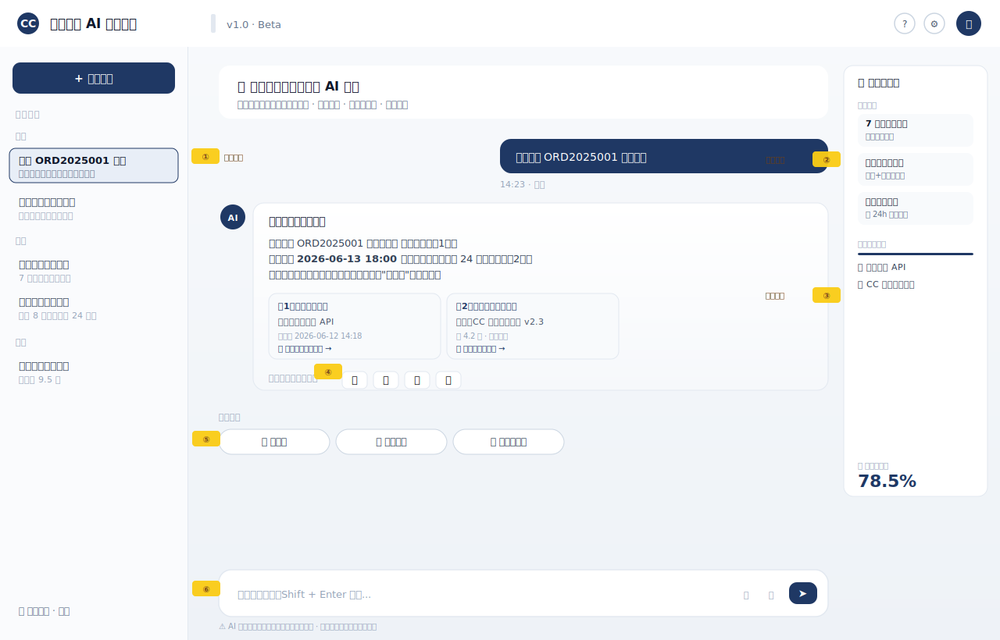
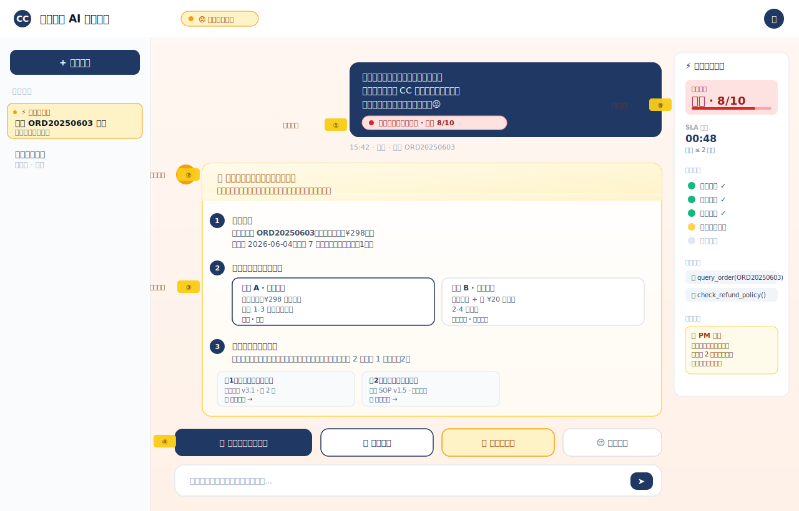

# CC商城 AI 客服助手 PRD v1.0

> 作者：[ZCC] | 日期：2026-06-11 | 版本：v1.0

## 1. 项目背景
据艾瑞咨询 2024 年报告，电商客服日均咨询量中 **65% 为重复性问题**（退换货、物流、优惠规则等），但人工客服平均响应时间 **3-5 分钟**，旺季高峰可达 30 分钟以上。本项目通过 AI 客服助手，以 RAG 技术实现 4 类核心问题的秒级精准回答，并通过情绪感知与 Agent 工具调用降低 30% 人工客服压力，提升用户满意度。

## 2. 目标用户与场景
### 2.1 用户画像
**1. 退换货用户**
- 角色名：小李 / 95后 / 职场新人
- 场景：收到网购的鞋子，发现尺码偏小，想换货
- 痛点：找不到人工客服，机器人反复让上传照片，流程繁琐
- 期望：1 分钟内确认能否换货、流程、运费、几天到
- KPI：退换货流程自助完成率（无需转人工）

**2. 物流追踪用户**
- 角色名：王姐 / 85后 / 宝妈
- 场景：给孩子买的玩具显示"已签收"，但实际没收到
- 痛点：物流信息不更新、显示异常，不知道找快递还是商家
- 期望：AI 告知包裹当前状态、预计到达时间，异常时自动核查
- KPI：物流异常自助解决率

**3. 优惠/参数咨询用户**
- 角色名：小陈 / 00后 / 学生党
- 场景：买蓝牙耳机前想确认优惠券能不能用、续航参数
- 痛点：商品详情页信息散乱，优惠规则看不懂
- 期望：直接得到能否用券、参数关键值的明确答案
- KPI：售前咨询后下单转化率

**4. 情绪化投诉用户**
- 角色名：张哥 / 80后 / 急脾气
- 场景：商品出现质量问题，多次催促物流无果
- 痛点：被机器人模板话术激怒，找不到人工入口
- 期望：被理解、被听见，能立刻看到解决方案或转人工
- KPI：负面情绪场景下的 NPS（净推荐值）

### 2.2 核心使用场景
| 场景 | 用户输入示例 | 期望输出 |
|---|---|---|
| 退换货咨询 | "买的鞋子小了能换吗" | 政策+步骤+预计到账 |
| 物流追踪 | "我的订单 12345 到哪了" | 实时位置+异常预警 |
| 优惠券查询 | "我这个券能用吗" | 适用范围+到期日 |
| 商品参数 | "蓝牙耳机续航多久" | 参数+引用商品说明 |
| 情绪安抚 | "这破东西怎么这么慢" | 共情+解决方案 |

### 2.3 关键页面原型

#### 图 1：对话主页

#### 图 2：情绪安抚场景

## 3. 核心指标（北极星 + 辅助）
- **北极星指标**：单次问答解决率（用户无需转人工即解决问题），目标 ≥ 70%

- **辅助指标**：
  - 效果指标：答案采纳率（👍/总反馈数），目标 ≥ 75%
  - 效率指标：首 Token 响应时长，目标 ≤ 1 秒；全答案 ≤ 8 秒
  - 质量指标：转人工率，目标 ≤ 25%
  - 体验指标：负面情绪识别准确率，目标 ≥ 85%
  - 业务指标：Agent 工具调用成功率，目标 ≥ 90%
  - 安全指标: 敏感信息泄露事件数，目标 = 0

## 4. 功能需求

### 4.1 功能清单（优先级）
| 编号 | 功能 | 优先级 | 简述 |
|---|---|---|---|
| F1 | 自然语言提问 | P0 | 用户输入框输入文本提问 |
| F2 | 流式回答展示 | P0 | 答案逐字显示，不是憋完才出 |
| F3 | 引用卡片 | P0 | 每条答案下挂 1-3 张原文出处卡片 |
| F4 | 多轮上下文 | P0 | 记住本轮对话 |
| F5 | 👍👎 反馈 | P0 | 用户对答案打分 |
| F6 | 情绪感知共情 | P0 | 检测负面情绪并共情回复 |
| F7 | 订单查询工具 | P1 | Agent 调用订单系统 |
| F8 | 退换货单创建 | P1 | Agent 帮用户提交退换货 |
| F9 | 转人工 | P1 | 一键转接人工客服 |
| F10 | 历史会话列表 | P2 | 左侧栏看过往对话 |
| F11 | 知识库管理后台 | P2 | 管理员上传/删除文档 |
| F12 | 数据看板 | P2 | 管理员看 DAU、采纳率 |

### 4.2 详细需求（P0 功能）

#### F1 自然语言提问

用户在下方输入框中输入文字，支持中英文、标点符号及换行，点击发送按钮或按回车键提交。系统接收后触发 RAG 检索流程，生成答案后以流式方式逐字返回。

**异常处理**：
- 输入为空或仅空格：发送按钮置灰不可点击
- 网络请求失败：提示"网络开小差了，请稍后重试"，保留输入框内容

---

#### F2 流式回答展示

用户提交问题后，答案以打字机效果逐字显示在对话气泡中，避免长时间等待无响应。首字返回前显示"正在思考中..."加载动画，首个字符应在 **1 秒内** 出现。

**异常处理**：
- 流式传输中断（如超时）：提示"回答生成中断，请点击重试"
- 保留已输出的部分内容，用户可点击重试重新发送原问题

---

#### F3 引用卡片

每条答案下方自动展示 **1-3 张原文出处卡片**，每张卡片包含：
- 文档标题
- 相关原文片段（30-50 字）
- 页码/章节位置

用户点击卡片可展开查看完整原文或跳转至知识库对应位置。

**异常处理**：
- 检索结果不足 1 条（答案完全由模型生成）：不展示引用卡片
- 答案末尾加注：「该回答仅供参考，未找到相关文档」

---

#### F4 多轮上下文

系统在当前会话窗口内记住用户本轮对话历史（包括用户提问和 AI 回答），最多保留 **最近 10 轮上下文**。用户连续追问时（如「那这个能用券吗」），系统自动识别指代关系并给出衔接性回答。

**边界情况**：
- 上下文超过 10 轮：按时间顺序丢弃最早记录
- 用户刷新页面或关闭窗口：上下文清空，新对话从头开始（MVP 版本不持久化）

---

#### F5 👍👎 反馈

每条 AI 答案下方设置 👍（有用）和 👎（无用）两个按钮，用户可点击任一进行评价：
- **点击 👍**：按钮高亮 + 弹出感谢提示「感谢反馈」
- **点击 👎**：弹出可选原因标签（「答非所问」「信息错误」「没有引用」「其他」），用户选择后提交

**特殊规则**：
- 同一答案可修改反馈（👍 ↔ 👎），以最后一次为准
- 反馈数据实时上报至数据看板用于计算采纳率

---

#### F6 情绪感知共情

系统实时分析用户输入文本，识别其中是否包含负面情绪关键词（如「太慢了」「气死我了」「垃圾」等）。

**触发行为**：
- 检测到负面情绪 → AI 回答首段优先输出共情语句（如「很抱歉给您带来不好的体验，我非常理解您的心情」），再给出解决方案
- 情绪强度高（含辱骂词汇）→ 答案末尾追加转人工入口「是否需要为您转接人工客服？」

**容错**：
- 情绪检测为纯模型判断，无外部依赖
- 若漏判，不影响正常回答流程，保证可用性优先

### 4.3 范围外（MVP 不做）
| 功能 | 不做的理由 | 后续版本 |
|---|---|---|
| 语音输入/输出 | 4 周不够；ASR/TTS 成本高 | V2 |
| 多语言（英/日） | 目标用户为国内 C 端 | V3 |
| 图片提问（拍商品） | 多模态模型成本高 | V2 |
| 智能推荐商品 | 偏离客服定位 | 独立项目 |
| 客服真人接管对话 | 需要 IM 系统支持 | V2 |

## 5. 非功能需求
- 性能：首 token < 1 秒，全答案 < 8 秒
- 安全：用户数据本地存储不上云
- 兼容：Chrome / Edge 主流浏览器

## 6. AI 专项
- **知识库范围**：50 篇 markdown/PDF（退换货政策、物流规则、商品手册、优惠券规则）
- **模型选型**（无 GPU 方案）：
  - LLM：DeepSeek-Chat（API，¥0.001/千 token，国内最便宜）
  - Embedding：硅基流动 bge-m3 API（免费额度内）或智谱 embedding-2
  - Rerank：bge-reranker-base（本地 CPU，~300MB，1 秒/批）
- **Prompt 风格**：友好、克制、不编造、必带引用
- **评测方案**：自建 50 条 Q&A 评测集（涵盖 5 类场景 + 10 条 Bad Case），每周回归

## 7. 上线计划
- W1：PRD + 原型 + 环境
- W2：后端 + 数据库 + 知识库灌库
- W3：RAG + 前端
- W4：Agent + 部署 + 上线 GitHub

## 8. 风险与应对
| 风险 | 可能性 | 影响 | 应对 |
|---|---|---|---|
| 模型幻觉编造政策 | 高 | 高 | Prompt 强约束 + 必须引用 + 评测兜底 |
| Token 成本失控 | 中 | 中 | 相似 Query 缓存 + 简单问题路由小模型 |
| 知识库质量差 | 高 | 高 | 50 篇 PDF 全人工 review + 标准化模板 |
| 情绪误识别引发不满 | 中 | 中 | 阈值调高 + 错判时不主动共情 |
| 个人项目缺乏真实流量验证 | 高 | 低 | 自建 50 条评测集模拟 + 录 Demo 视频 |