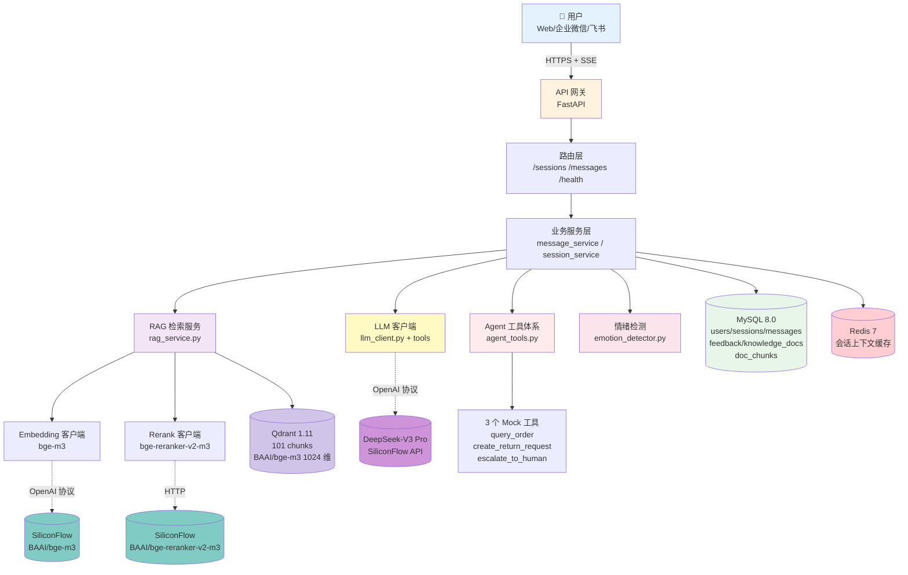
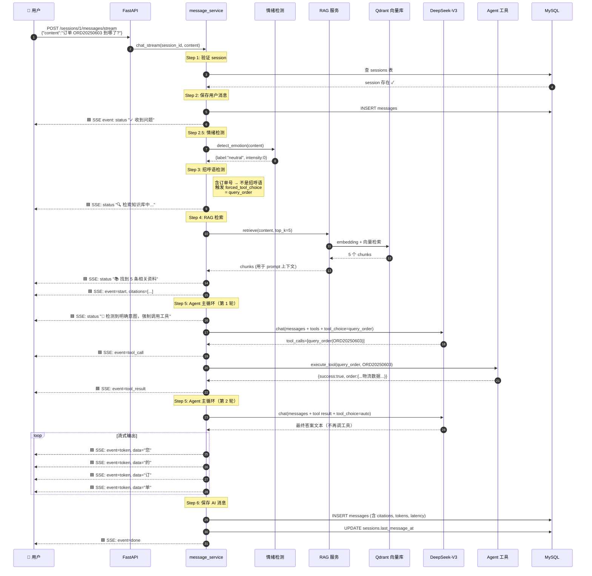
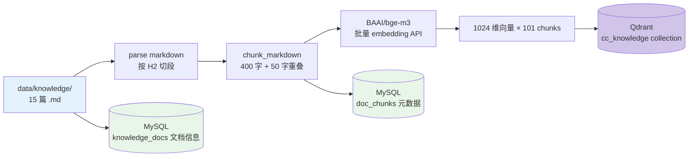
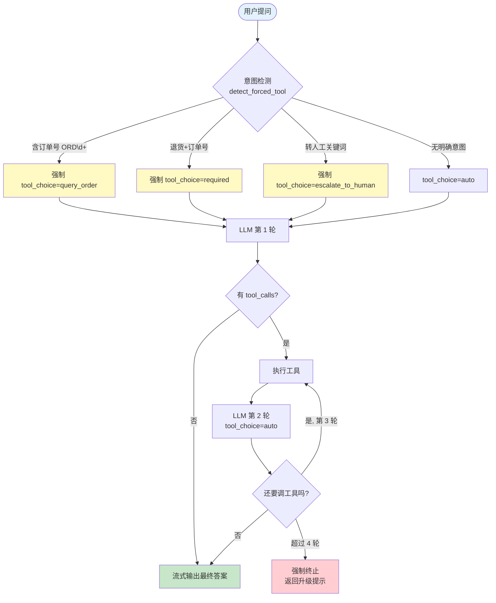

# 🏗 CC 商城 AI 客服 · 系统架构文档

> 文档版本：v1.0
> 适用阶段：MVP（W1-W4）

---

## 1. 整体架构图（C4 - Level 1）



---

## 2. 一次问答完整时序图



---

## 3. RAG 离线灌库流程



---

## 4. Agent 决策树



---

## 5. 数据库 ER 图

```mermaid
erDiagram
    USERS ||--o{ SESSIONS : has
    SESSIONS ||--o{ MESSAGES : contains
    MESSAGES ||--o| FEEDBACK : may_have
    KNOWLEDGE_DOCS ||--o{ DOC_CHUNKS : split_into

    USERS {
        bigint id PK
        string external_id
        string name
        enum role "customer/admin"
        datetime created_at
    }

    SESSIONS {
        bigint id PK
        bigint user_id FK
        string title
        enum status "active/closed/escalated"
        string emotion_label
        datetime created_at
        datetime last_message_at
    }

    MESSAGES {
        bigint id PK
        bigint session_id FK
        enum role "user/assistant/system"
        text content
        json citations
        int token_count
        string model_name
        int latency_ms
        datetime created_at
    }

    FEEDBACK {
        bigint id PK
        bigint message_id FK,UQ
        enum type "like/dislike"
        string reason
        string comment
    }

    KNOWLEDGE_DOCS {
        bigint id PK
        string title
        string source_path
        string category
        int chunk_count
    }

    DOC_CHUNKS {
        bigint id PK
        bigint doc_id FK
        int chunk_index
        text content
        string section
        string vector_id "Qdrant point id"
    }
```

---

## 6. 部署架构（W1-W4 本地 + 未来生产建议）

### 当前（本地开发）

```
┌────────────────────────────────────────┐
│  开发者本机（Windows + Docker Desktop）│
│                                        │
│  ┌─────────────────────────────────┐   │
│  │ Python 进程（uvicorn）           │   │
│  │   FastAPI :8000                 │   │
│  └────────────┬────────────────────┘   │
│               │                        │
│  ┌────────────▼──────────────────────┐ │
│  │ Docker Compose                    │ │
│  │   - MySQL :13306                  │ │
│  │   - Redis :6379                   │ │
│  │   - Qdrant :6333                  │ │
│  │   - Adminer :8080                 │ │
│  └────────────────────────────────────┘ │
└────────────────────────────────────────┘
           │
           │ HTTPS
           ▼
  ┌────────────────┐
  │ 硅基流动 API     │
  │ DeepSeek API   │
  └────────────────┘
```

### 未来生产架构（V2 - 不在本项目范围）

- **Web 层**：Nginx 反向代理 + SSL + 限流
- **应用层**：3+ FastAPI 实例（K8s HPA 弹性扩缩）
- **缓存层**：Redis Cluster
- **数据层**：MySQL 主从读写分离
- **向量库**：Qdrant Cluster（3 节点）
- **可观测**：Prometheus + Grafana + Sentry
- **CI/CD**：GitHub Actions → 镜像仓库 → K8s 滚动更新

---

## 7. 关键设计决策

| 决策点 | 选 A | 选 B | 选 | 原因 |
|---|---|---|---|---|
| LLM 协议 | OpenAI Function Calling | LangChain Agent | **A** | 协议标准、跨厂商 |
| 向量库 | Milvus | Qdrant | **Qdrant** | CPU 友好，本地 Docker |
| 流式协议 | WebSocket | SSE | **SSE** | 单向流式更简单 |
| RAG 切分 | 固定长度 | 按 H2 标题 + 长度兜底 | **B** | 语义完整 |
| Rerank | 启用 | 暂不启用 | **暂不** | 65 题评测 100%，无收益 |
| 多供应商 | 锁定一家 | 分能力路由 | **分能力路由** | 防绑定 + 成本/性能最优 |
| Function call 控制 | tool_choice=auto | 检测意图 + 强制 | **强制** | 防 In-Context Learning Bias |

---

## 8. 已知 issues 与未来优化

| 编号 | 问题 | 影响 | 优先级 | 计划 |
|---|---|---|---|---|
| #01 | 首 Token 延迟 2-3s（免费 API 限制）| 用户体感 | 中 | V2 接入更快 LLM / 本地推理 |
| #02 | 知识库仅 100 chunks（mock 数据）| 演示用 | 低 | 生产环境对接真实知识库 |
| #03 | 无管理后台 | 运营难管控 | 中 | V2 加 React 管理 UI |
| #04 | 无前端正式 UI（仅测试 HTML）| 用户视角不全 | 中 | V2 React + Ant Design 完整页面 |
| #05 | 情绪检测仅关键词版 | 召回有限 | 低 | V3 升级 LLM 情绪分类 |
| #06 | 工具调用日志未入库 | 难复盘 | 低 | V2 加 tool_call_logs 表 |
